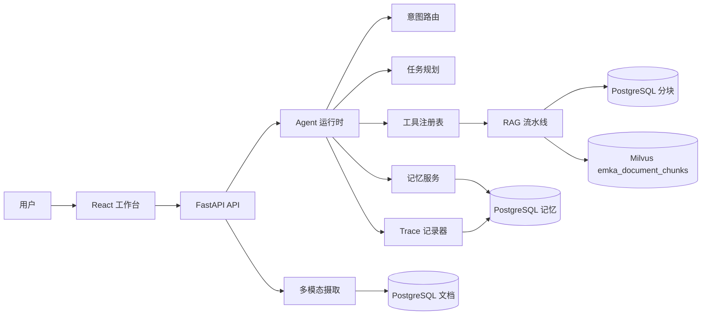

# EMKA

EMKA 是一个企业多模态知识 Agent 演示工作区，全称为 Enterprise Multimodal Knowledge Agent。

## Docker 演示

```bash
cd EMKA
docker compose up --build
```

启动后可访问：

- 工作台：`http://127.0.0.1:5173`
- 后端健康检查：`http://127.0.0.1:8000/health`
- PostgreSQL：`127.0.0.1:5432`
- Milvus：`127.0.0.1:19530`

Docker 编排会同时启动前端、后端、PostgreSQL、Milvus standalone、etcd 和 MinIO。后端使用 mock LLM 行为、确定性的本地 embedding、轻量级 PDF/docx/xlsx 解析，以及稳定的 mock OCR 文本，因此演示环境不依赖真实大模型服务或 OCR 引擎。

## 系统架构



## 运行流程

```text
chat -> 读取记忆 -> 意图路由 -> 任务规划 -> 工具调用 -> RAG 检索 -> 记录 trace -> 写入记忆 -> 返回响应
```

主要接口：

- `GET /health`
- `POST /api/v1/documents/upload`
- `GET /api/v1/documents`
- `POST /api/v1/chat`
- `GET /api/v1/traces/{id}`
- `GET /api/v1/memories?user_id=...`

## 多模态摄取

```text
upload -> detector -> parser(text/table/ocr) -> normalizer -> document -> chunks -> embeddings -> Milvus
```

支持上传的文件类型：

- 文本：`txt`、`md`、`pdf`、`docx`
- 表格：`csv`、`xlsx`
- 图片：`png`、`jpg`、`jpeg`

表格引用会包含行范围；图片引用会包含 `ocr_confidence`。当前 OCR 文本是稳定的 mock 输出，演示时不需要安装 Tesseract 或 EasyOCR。

## Trace 示例

```json
{
  "id": "trace-id",
  "intent": "search_knowledge",
  "route_confidence": 0.82,
  "plan": [
    {"tool": "search_docs", "action": "retrieve relevant knowledge"},
    {"tool": "generate_report", "action": "generate report"}
  ],
  "retrieved_docs": [
    {
      "document_id": "doc-id",
      "title": "revenue.csv",
      "modality": "table",
      "score": 0.91,
      "citation": "revenue.csv rows 2-4"
    }
  ],
  "tool_calls": [
    {"tool_name": "search_docs", "success": true, "latency_ms": 8}
  ],
  "memory_ops": [
    {"op": "read", "memory_type": "session", "count": 1},
    {"op": "write", "memory_type": "user", "memory_id": "memory-id"}
  ],
  "ingestion_ops": [],
  "status": "success"
}
```

## 本地开发

后端：

```bash
cd EMKA
conda activate emka
python -m pip install -r backend/requirements.txt
python -m uvicorn backend.app.main:app --reload
```

前端：

```bash
cd EMKA/frontend
npm install
npm run dev
```

测试与构建：

```bash
cd EMKA
pytest

cd frontend
npm run build
```

## 演示脚本

1. 使用 `docker compose up --build` 启动完整服务。
2. 打开 `http://127.0.0.1:5173`。
3. 在左侧面板上传 `txt`、`csv` 或 `png` 文件。
4. 确认文档列表显示标题、模态类型、分块数量和索引状态。
5. 在聊天面板提问，例如 `Summarize the uploaded documents and cite sources`。
6. 在中间区域查看回答和报告。
7. 在右侧面板检查 trace、检索到的文档、工具调用、记忆操作和摄取记录。

更多说明：

- [架构说明](docs/architecture.md)
- [多模态摄取](docs/multimodal-ingestion.md)
- [演示脚本](docs/demo-script.md)

## 当前边界

- LLM 调用目前是 mock 行为。
- OCR 文本目前是 mock 输出，但会真实提取图片元数据。
- PostgreSQL 和 Milvus 已接入 Docker 演示环境。
- 本项目用于演示，不是生产部署模板。
