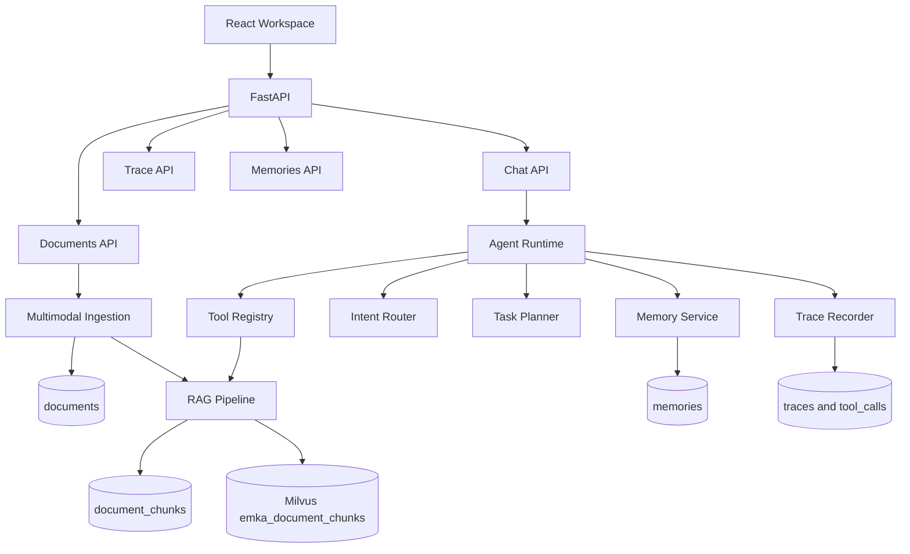

# EMKA Architecture

## System View



## Runtime Flow

```text
POST /api/v1/chat
  -> ensure demo user/conversation
  -> load session/user/knowledge memory
  -> route intent
  -> build task plan
  -> execute tools
  -> search RAG indexed documents
  -> record trace and tool calls
  -> write session/user memory
  -> return answer, report, route, plan, trace_id, retrieved_docs, memory_ops
```

## Docker Stack

`docker compose up` starts:

- `frontend`: Nginx serving the built React workspace and proxying `/api` to backend.
- `backend`: FastAPI runtime on port `8000`.
- `postgres`: schema initialized from `database/migrations/001_init.sql`.
- `milvus`: standalone vector store for `emka_document_chunks`.
- `etcd` and `minio`: Milvus dependencies.

## Storage

- PostgreSQL stores users, conversations, memories, documents, document chunks, traces, and tool calls.
- Milvus stores chunk vectors keyed by `embedding_id`.
- The RAG retriever joins vector hits back to `document_chunks` and `documents` for title, modality, snippet, and citation.
